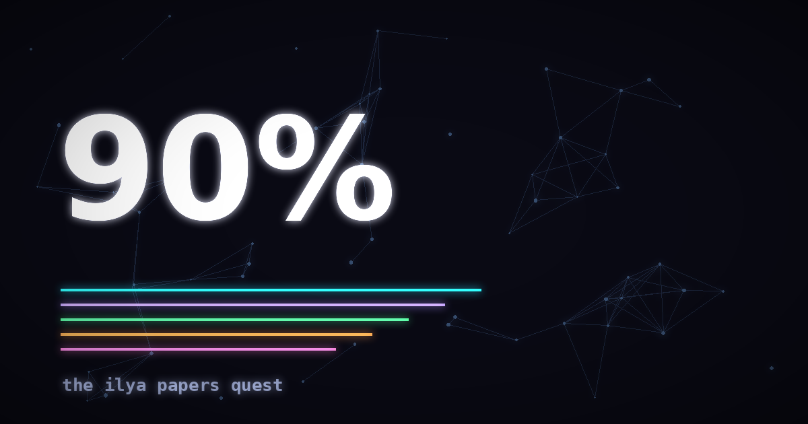

# 90% — The Ilya Papers Quest



A gamified learning RPG built around Ilya Sutskever's well-known AI reading list. Work through 32 levels across five worlds, complete interactive labs and quizzes, fight five bosses, earn achievements, and keep your progress in a portable local save file.

## Features

- Five learning tracks spanning neural-network foundations through scaling and vision
- Interactive paper walkthroughs, labs, quizzes, and boss battles
- XP, ranks, streaks, badges, and a skill-tree map
- Local-first progress with save-file import and export
- Responsive UI with animated 2D and 3D elements

## Run locally

Requires Node.js 20 or newer.

```bash
npm ci
npm run dev
```

Open [http://localhost:3000](http://localhost:3000).

## Build

```bash
npm run build
npm run preview
```

The production build is written to `dist/`.

## Tech stack

React 19, TypeScript, Vite, Tailwind CSS, Zustand, Framer Motion, GSAP, React Three Fiber, and KaTeX.

## Deployment

Pushes to `main` are deployed automatically with the GitHub Pages workflow in `.github/workflows/deploy-pages.yml`.

This is an independent educational project and is not affiliated with or endorsed by Ilya Sutskever.
